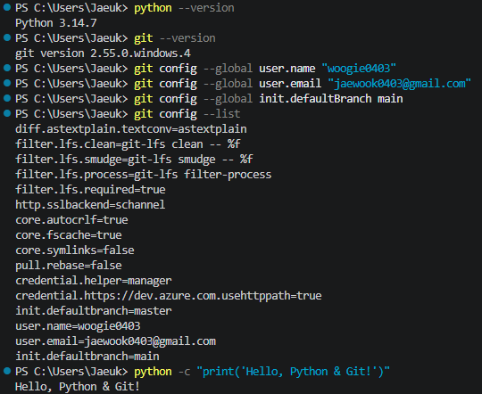
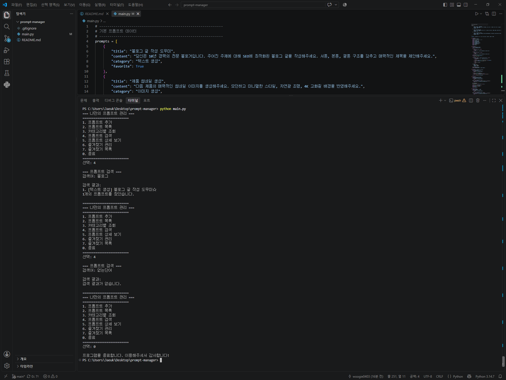
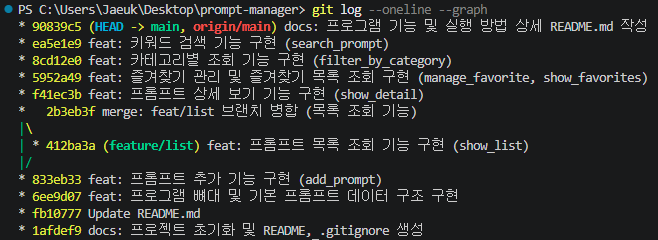
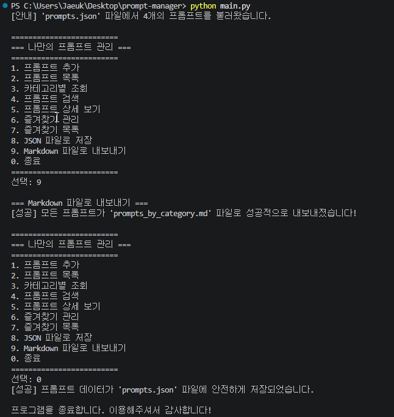

# 🚀 나만의 프롬프트 관리 프로그램 (Prompt Manager)

AI 프롬프트(텍스트, 이미지, 페르소나 등)를 체계적으로 등록, 분류, 검색, 관리할 수 있는 파이썬 콘솔 기반 소프트웨어입니다.  
Python 기초 문법과 Git 형상 관리를 실무 수준으로 학습하고 적용한 프로젝트입니다.

---

## 📌 주요 기능 목록

1. **프롬프트 추가**: 제목, 내용, 카테고리를 입력받아 새로운 프롬프트를 등록 (빈값 입력 검증 포함)
2. **프롬프트 목록 조회**: 등록된 모든 프롬프트의 번호, 카테고리, 제목, 즐겨찾기 여부(☆) 확인 (*기능 브랜치 작업 후 병합*)
3. **카테고리별 조회**: 카테고리를 선택하여 해당 카테고리에 속한 프롬프트만 필터링하여 조회
4. **프롬프트 검색**: 키워드를 입력받아 제목 또는 내용에 포함된 프롬프트를 검색 (대소문자 무시)
5. **프롬프트 상세 보기**: 번호를 입력받아 해당 프롬프트의 전체 내용과 세부 정보를 확인
6. **즐겨찾기 관리**: 원하는 프롬프트의 즐겨찾기를 추가하거나 해제 (토글 방식)
7. **즐겨찾기 목록**: 즐겨찾기된 핵심 프롬프트만 모아서 확인
8. **데이터 영속화 (보너스 과제)**: `prompts.json` 파일을 통해 프로그램을 재시작해도 데이터가 영구 보존
9. **Markdown 내보내기 (보너스 과제)**: 전체 프롬프트를 카테고리별 마크다운 문서(`prompts_by_category.md`)로 자동 추출
10. **프로그램 종료**: 메뉴에서 0번을 선택하여 안전하게 종료

---

## 📂 지원 카테고리 안내

- `텍스트 생성`: 블로그 글, 이메일, 보고서 등 텍스트 작성을 돕는 프롬프트
- `이미지 생성`: Midjourney, DALL-E 등 이미지 생성용 고화질 묘사 프롬프트
- `영상 생성`: 광고 스크립트, 영상 스토리보드 기획용 프롬프트
- `페르소나`: 전문가, 컨설턴트 등 특정 직무의 역할을 부여하는 프롬프트
- `자동화`: 뉴스 요약, 데이터 전처리, 노코드 연동 프롬프트
- `기타`: 사용자가 직접 입력한 커스텀 카테고리

---

## 🛠️ 개발 환경 및 기술 스택

- **언어**: Python 3.10 이상 (Python 3.14.7 환경에서 검증)
- **버전 관리**: Git, GitHub
- **외부 라이브러리**: 내장 표준 라이브러리만 사용 (외부 의존성 없음)

---

## 💻 실행 방법

### 1. 저장소 클론 (선택)
```bash
git clone https://github.com/woogie0403/prompt-manager.git
cd prompt-manager
```

### 2. 프로그램 실행
```bash
python main.py
```

---

## 📸 과제 수행 증빙 스크린샷

### 1. 개발 환경 설정


### 2. 프로그램 실행 결과


### 3. Git Graph (브랜치 및 커밋 이력)


### 4. 보너스 과제 실행 결과 (JSON 영속화 및 Markdown 내보내기)
